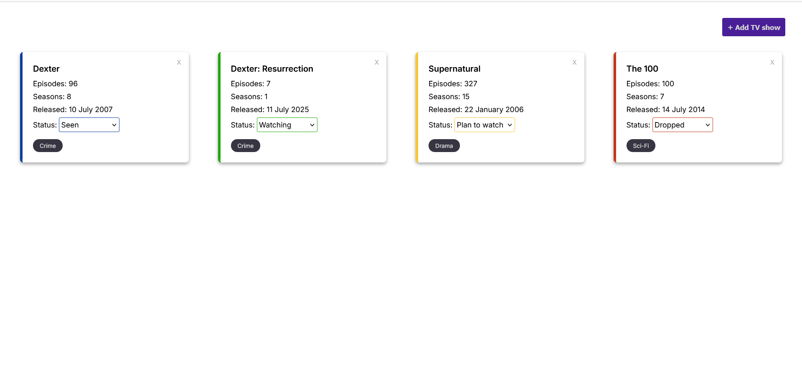
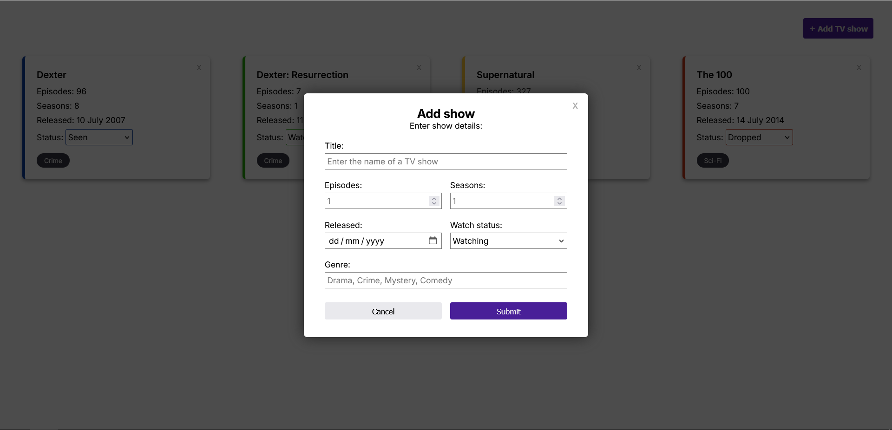

# TV show library

A responsive web application for tracking TV shows you're following: Watching, Seen, Plan to watch or dropped, it can all be done in one place!

I wanted this to be a modern minimal design. All focus is on the cards so you can quickly see an overview of everything you're tracking.

## Key features

I used vanilla HTML, CSS and Javascript to make this project, bringing together the fundamentals I've learnt to create an app that takes user-submitted data, validates the data, creates a card from it and syncs between the array and local storage. Cards can also be deleted easily.

- Dynamic card creation and UI updates
- watch status tracking
- Data persistence through local storage implementation
- Modular architecture
- Form validation

